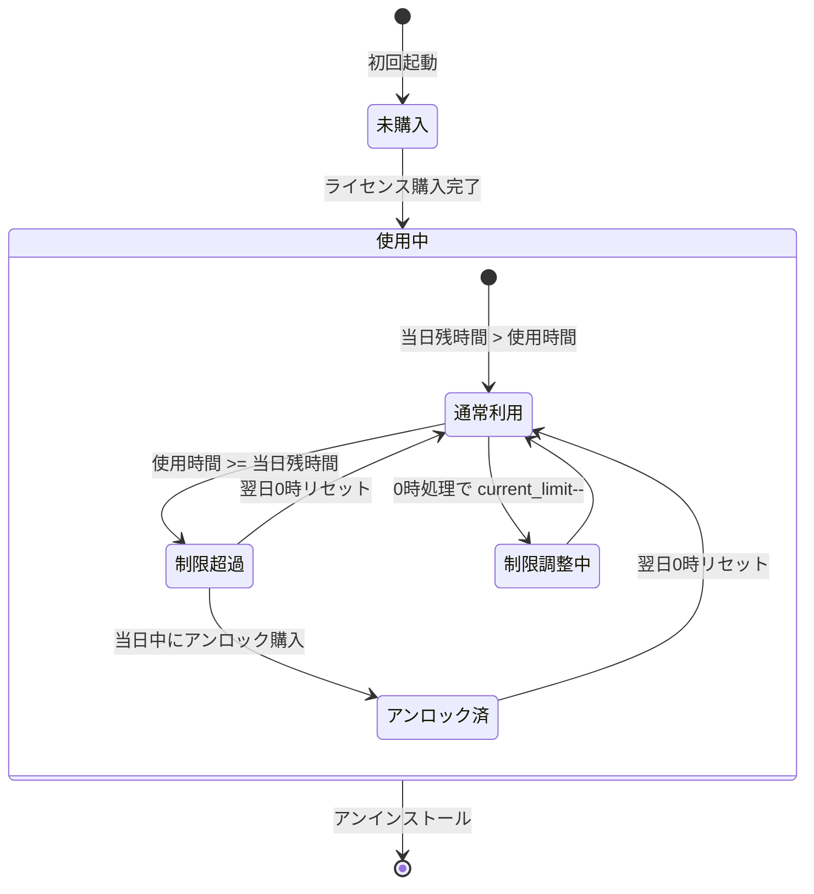

# 🔄 状態遷移図 - Timekeeper（v2仕様）

```mermaid
stateDiagram-v2
    [*] --> 未購入 : 初回起動
    未購入 --> 使用中 : ライセンス購入完了

    state 使用中 {
        [*] --> 通常利用 : 当日残時間 > 使用時間
        通常利用 --> 制限超過 : 使用時間 >= 当日残時間
        制限超過 --> アンロック済 : 当日中にアンロック購入
        アンロック済 --> 通常利用 : 翌日0時リセット
        制限超過 --> 通常利用 : 翌日0時リセット
        通常利用 --> 制限調整中 : 0時処理で current_limit--
        制限調整中 --> 通常利用
    }

    使用中 --> [*] : アンインストール

```