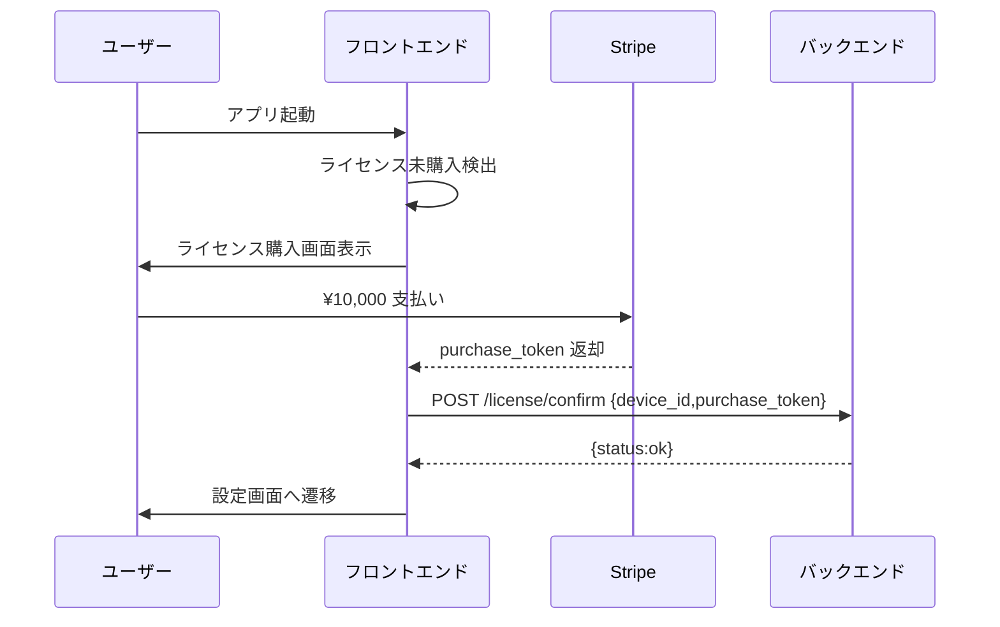
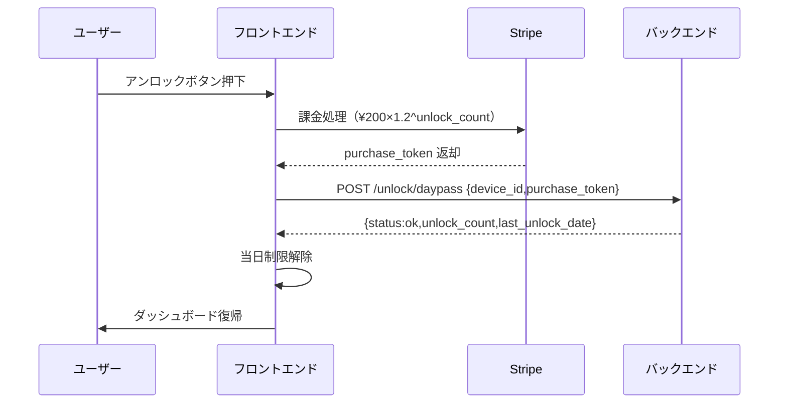

---

---
# 🔁 シーケンス図一覧 - Timekeeper（v2仕様）

---

## UC01: 初回起動・ライセンス購入

```mermaid
sequenceDiagram
    participant U as ユーザー
    participant FE as フロントエンド
    participant Stripe as Stripe
    participant API as バックエンド

    U->>FE: アプリ起動
    FE->>FE: ライセンス未購入検出
    FE->>U: ライセンス購入画面表示
    U->>Stripe: ¥10,000 支払い
    Stripe-->>FE: purchase_token 返却
    FE->>API: POST /license/confirm {device_id,purchase_token}
    API-->>FE: {status:ok}
    FE->>U: 設定画面へ遷移

```

---

## UC06: デイパス課金

```mermaid
sequenceDiagram
    participant U as ユーザー
    participant FE as フロントエンド
    participant Stripe as Stripe
    participant API as バックエンド

    U->>FE: アンロックボタン押下
    FE->>Stripe: 課金処理（¥200×1.2^unlock_count）
    Stripe-->>FE: purchase_token 返却
    FE->>API: POST /unlock/daypass {device_id,purchase_token}
    API-->>FE: {status:ok,unlock_count,last_unlock_date}
    FE->>FE: 当日制限解除
    FE->>U: ダッシュボード復帰

```